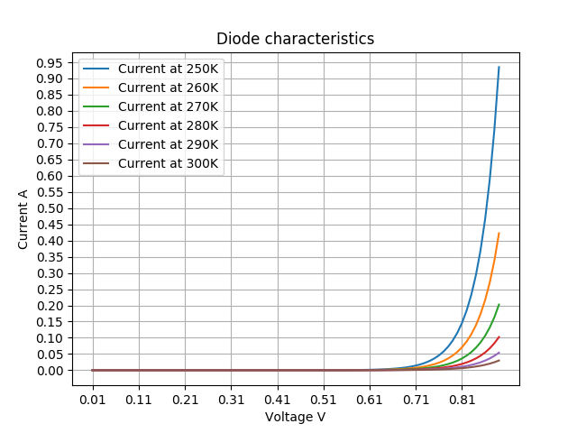
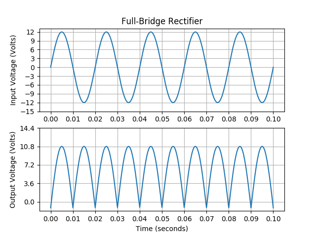

# Diode

## Diode Characteristics (`Diode.py`)

Using the Shockley formula, we can compute the current through a diode.

_I(Vd) = I0 ( e qVd / nkT  - 1)_

- I(Vd) - current through the diode
- I0 - saturation current of the diode
- q - elementary charge of the electron
- Vd - voltage drop over the diode
- k - Boltzmann's Constant
- n - material's constant
- T - Temperature in Kelvin

The program computes the current, for voltages ranging from 0V to 0.9V, at 5 temperatures ( 250->300K )

## Full-Bridge Rectifier (`Full-Bridge Rectifier.py`)

This program shows how the rectifier changes the signal. The signal has a frequency of 50Hz, with an amplitude of 12V.
I also chose to use a threshold voltage of 0.6V for all the diodes.

